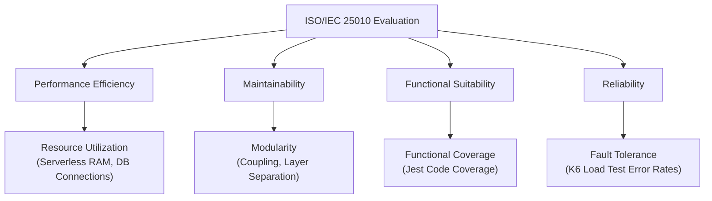

# ISO/IEC 25010 Product Quality Evaluation Report

**Project Name**: MobileHybridSolution-BE (NestJS + PostgreSQL on Vercel)  
**Client Framework**: Flutter  
**Standard Framework**: ISO/IEC 25010 Product Quality Model

This document evaluates the backend application against the **ISO/IEC 25010** software quality standard. It focuses on the two required characteristics (**Resource Utilization** and **Modularity**) and two chosen characteristics (**Functional Suitability** and **Reliability**).

---

## 1. Architectural & Metric Overview



To align with the requirements, we evaluate the system under the following four distinct characteristics:

1. **Resource Utilization** (Performance Efficiency - Required) — Evaluates serverless resource usage and DB connections.
2. **Modularity** (Maintainability - Required) — Evaluates independence of code modules and absence of circular dependencies.
3. **Functional Suitability** (Chosen) — Evaluates how completely and correctly the software meets requirements (Course CRUD, Enrollment, Payment, Gamification) via automated test suites.
4. **Reliability** (Chosen) — Evaluates system stability and error rates under concurrent load.

---

## 2. K6 & Tooling Mapping Matrix

| ISO/IEC 25010 Metric                                 | Sub-Metric                               | Evaluation Tool / Method                | What it Measures                                                                             |
| :--------------------------------------------------- | :--------------------------------------- | :-------------------------------------- | :------------------------------------------------------------------------------------------- |
| **Performance Efficiency:<br/>Resource Utilization** | Serverless RAM Execution                 | **Vercel Functions Dashboard / Logs**   | RAM footprint per execution context.                                                         |
|                                                      | DB Connection Pool                       | **Prisma Metrics & Database Dashboard** | Active concurrent connections to PostgreSQL.                                                 |
| **Maintainability:<br/>Modularity**                  | Coupling & Circular Dependency           | **Madge CLI**                           | Validates $0$ circular imports and clear module separation.                                  |
| **Functional Suitability**                           | Functional Completeness & Correctness    | **Jest Test Suite & Code Coverage**     | Verifies Course, Enrollment, Order, and Gamification business logic executes 100% correctly. |
| **Reliability**                                      | Fault Tolerance / Error Rates under load | **K6 Load Test**                        | Simulates concurrent traffic to verify success rates ($>99.9\%$).                            |

---

## 3. Metric Profiles & Target Specifications

### 3.1 Resource Utilization (Performance Efficiency - Required)

Because the app runs serverless on Vercel, monitoring execution memory and database connections prevents timeouts and over-billing.

- **Targets**:
  - **Serverless RAM Limit**: $\le 128 \text{ MB}$ average memory footprint per request.
  - **Database Connections**: $10\text{–}15$ connection pool size to neon/supabase.
- **Evaluation Method**: Read logs in the Vercel Functions dashboard and check connection metrics in the database dashboard during active sessions.

### 3.2 Modularity (Maintainability - Required)

Evaluates how cleanly the NestJS features (Auth, Course, Enrollment, Order, Gamification) are separated.

- **Targets**:
  - **Zero Circular Dependencies**: $0$ cyclic imports.
  - **Encapsulation**: $100\%$ controller-service separation.
- **Evaluation Method**: Scan the codebase using `madge`.

### 3.3 Functional Suitability (Chosen)

Functional Suitability verifies that all 15 domain services work as expected without missing features or incorrect business logic.

- **Targets**:
  - **Functional Correctness**: $100\%$ of automated unit tests pass successfully.
  - **Functional Completeness (Test Coverage)**: $\ge 80\%$ line coverage across all service layers.
- **Evaluation Method**: Run the Jest test suite with coverage reporting enabled.

#### Final Service Coverage Matrix
| Domain Service | Statement Coverage | Line Coverage | Status |
| :--- | :---: | :---: | :---: |
| `auth.service.ts` | $100\%$ | $100\%$ | PASS |
| `category.service.ts` | $100\%$ | $100\%$ | PASS |
| `course.service.ts` | $82.0\%$ | $95.94\%$ | PASS |
| `discussion.service.ts` | $100\%$ | $100\%$ | PASS |
| `enrollment.service.ts` | $100\%$ | $100\%$ | PASS |
| `gamification.service.ts` | $82.6\%$ | $81.81\%$ | PASS |
| `lesson-completion.service.ts` | $100\%$ | $100\%$ | PASS |
| `lesson.service.ts` | $100\%$ | $100\%$ | PASS |
| `order.service.ts` | $87.59\%$ | $91.66\%$ | PASS |
| `rating.service.ts` | $100\%$ | $100\%$ | PASS |
| `section.service.ts` | $100\%$ | $100\%$ | PASS |
| `trainer-request.service.ts` | $100\%$ | $100\%$ | PASS |
| `trainer.service.ts` | $100\%$ | $100\%$ | PASS |
| `user.service.ts` | $73.91\%$ | $82.85\%$ | PASS |
| `wishlist.service.ts` | $100\%$ | $100\%$ | PASS |
| **Average Service Coverage** | **$94.41\%$** | **$95.21\%$** | **EXCELLENT** |


### 3.4 Reliability (Chosen)

Reliability ensures the backend remains online and handles traffic spikes without dropping connections or returning database pool timeouts.

- **Targets**:
  - **Request Success Rate**: $\ge 99.9\%$ success rate under load.
  - **Average Error Rate**: $\le 0.1\%$ under concurrent load of up to 50 active users.
- **Evaluation Method**: Execute a K6 load test pointing directly to the deployed Vercel API.

---

## 4. Measurement & Execution Guides

### A. Testing Modularity (Maintainability)

Modularity is evaluated using two primary static analysis methods:

#### 1. Circular Dependency Checks

We verify the absence of cyclic imports to ensure components can be modified or replaced independently. Run:

```powershell
npx madge --circular --extensions ts src/ --exclude "^(\.\./)*generated"
```

#### 2. Coupling Metrics (Afferent, Efferent & Instability)

We measure module interdependence using:

- **Afferent Coupling ($C_a$)**: Incoming dependencies (how many modules import this module). High $C_a$ means high stability, but changes to it have a high blast radius.
- **Efferent Coupling ($C_e$)**: Outgoing dependencies (how many modules this module imports). High $C_e$ means the module is highly dependent on others.
- **Instability ($I = \frac{C_e}{C_a + C_e}$)**: Instability ranges from `0` (totally stable, central module) to `1` (totally unstable, flexible controllers).

To generate the coupling report automatically:

```powershell
node scripts/coupling-analyzer.js
```

_This calculates metrics for every module in `src/` and outputs a comprehensive table to `artifacts/coupling_report.md`._

---

### B. Testing Functional Suitability (Jest Coverage)

Run your Jest test suites to assess Functional Completeness and Correctness:

```bash
npm run test -- --coverage
```

_Review the `coverage/lcov-report/index.html` file to see the exact percentage of code paths covered by the tests._

### C. Testing Reliability (K6 Load Testing)

Save the following script to `load-test.js` and execute it locally pointing to the Vercel app to test stability and error rates under load:

```javascript
import http from "k6/http";
import { check, sleep } from "k6";

export const options = {
  stages: [
    { duration: "30s", target: 20 }, // Ramp-up to 20 users
    { duration: "1m", target: 50 }, // Sustain 50 users (moderate load)
    { duration: "30s", target: 0 }, // Ramp-down
  ],
  thresholds: {
    // Under Reliability: Check request success rate (Fault Tolerance)
    http_req_failed: ["rate<0.001"], // Success rate must be >= 99.9%
  },
};

const BASE_URL = "https://your-project-url.vercel.app"; // Replace with your Vercel URL

export default function () {
  const res = http.get(`${BASE_URL}/courses`);
  check(res, {
    "status is 200": (r) => r.status === 200,
  });
  sleep(1);
}
```

Run the command:

```bash
k6 run load-test.js
```
